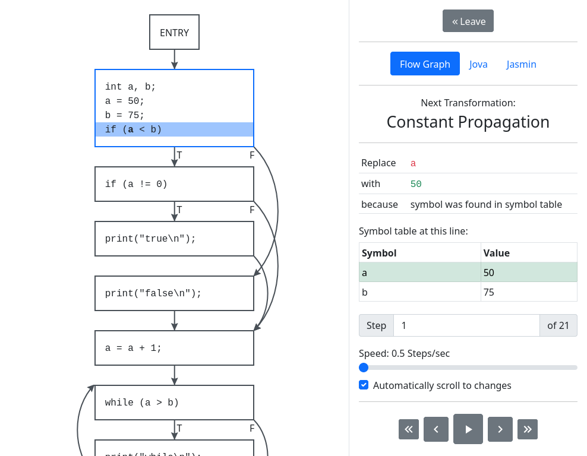

# VisOpt: Visual Optimizer

VisOpt is a web application for visualization of compiler optimizations.

Try it out [here](http://ccvisual.ist.tugraz.at/).

Currently supported optimizations are:

- Algebraic Simplification
- Common Subexpression Elimination
- Constant Folding
- Constant Propagation
- Copy Propagation
- Dead Code Elimination
- Reduction in Strength

To add new optimizations, search for "Add new Optimizations here.".

